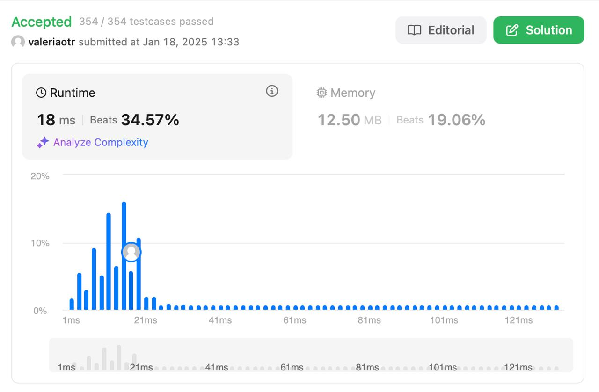

# Regular Expressions Matching
## Level: Hard
## Description

Given an input string `s` and a pattern `p`, implement regular expression matching with support for `.` and `*` where:

`.` Matches any single character.

`*` Matches zero or more of the preceding element.
The matching should cover the entire input string (not partial).

### Example 1:

Input: s = `aa`, p = `a`
Output: false
Explanation: "a" does not match the entire string "aa".

### Example 2:

Input: s = `aa`, p = `a*`
Output: true
Explanation: '*' means zero or more of the preceding element, 'a'. Therefore, by repeating 'a' once, it becomes "aa".
### Example 3:

Input: s = `ab`, p = `.*
Output: true
Explanation: ".*" means "zero or more (*) of any character (.)".
 

Constraints:

1 <= s.length <= 20
1 <= p.length <= 20
s contains only lowercase English letters.
p contains only lowercase English letters, '.', and '*'.
It is guaranteed for each appearance of the character '*', there will be a previous valid character to match.

## Solution

Реализовано решение задачи с использованием **динамического программирования (DP)**.

#### Основные шаги:

1. **Инициализация DP-таблицы**:
   - Создается двумерный массив `dp`, где `dp[i][j]` указывает, соответствует ли первые `i` символов строки `s` первым `j` символам шаблона `p`.
   - Устанавливаем `dp[0][0] = True` (пустая строка соответствует пустому шаблону).
   - Обрабатываем случаи, где шаблон содержит `*`, так как `*` может означать "ноль вхождений" предыдущего элемента.

2. **Основная логика**:
   - Для каждого символа строки `s` и шаблона `p` выполняем:
     - Если символы совпадают (`s[i-1] == p[j-1]`) или текущий символ шаблона равен `.`:
       ```
       dp[i][j] = dp[i-1][j-1]
       ```
     - Если текущий символ шаблона равен `*`:
       ```
       dp[i][j] = dp[i][j-2] or (dp[i-1][j] and (s[i-1] == p[j-2] or p[j-2] == '.'))
       ```
       - `dp[i][j-2]`: игнорируем `*` и предшествующий символ.
       - `dp[i-1][j]`: рассматриваем предыдущий символ, если он совпадает.

3. **Возврат результата**:
   - Результат находится в `dp[len(s)][len(p)]`.

#### Примеры:

- **Пример 1:**
  ```
  Input: s = "aa", p = "a"
  Output: False
  Explanation: "a" не покрывает всю строку "aa".
  ```

- **Пример 2:**
  ```
  Input: s = "aa", p = "a*"
  Output: True
  Explanation: '*' означает ноль или более вхождений символа 'a'.
  ```

- **Пример 3:**
  ```
  Input: s = "ab", p = ".*"
  Output: True
  Explanation: ".*" означает "ноль или больше любого символа".
  
## Result
