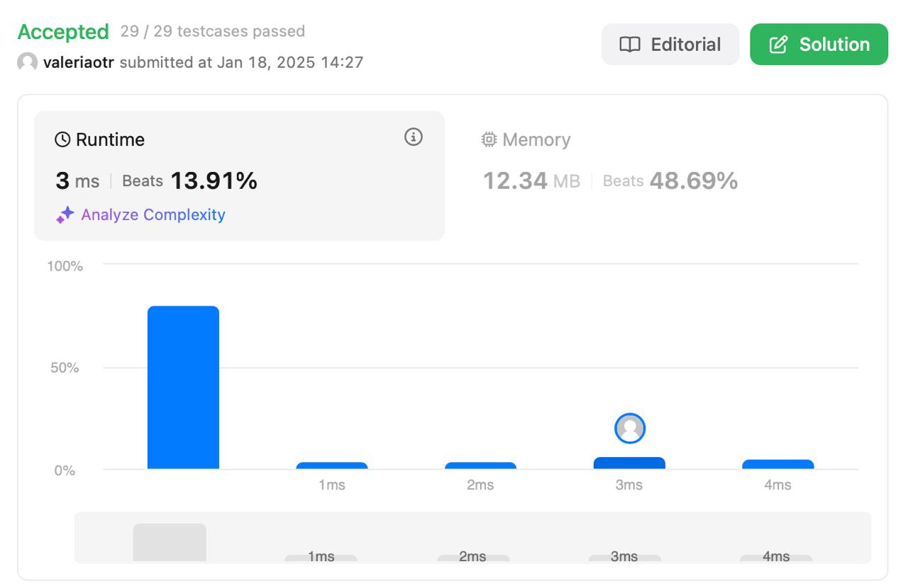

# Text Justification
## Level: Hard

## Description

Given an array of strings `words` and a width `maxWidth`, format the text such that each line has exactly `maxWidth` characters and is fully (left and right) justified.

You should pack your words in a greedy approach; that is, pack as many words as you can in each line. Pad extra spaces `' '` when necessary so that each line has exactly `maxWidth` characters.

Extra spaces between words should be distributed as evenly as possible. If the number of spaces on a line does not divide evenly between words, the empty slots on the left will be assigned more spaces than the slots on the right.

For the last line of text, it should be left-justified, and no extra space is inserted between words.

### Example 1:

Input:
```
words = ["This", "is", "an", "example", "of", "text", "justification."], maxWidth = 16
```
Output:
```
[
   "This    is    an",
   "example  of text",
   "justification.  "
]
```

### Example 2:

Input:
```
words = ["What","must","be","acknowledgment","shall","be"], maxWidth = 16
```
Output:
```
[
  "What   must   be",
  "acknowledgment  ",
  "shall be        "
]
```

### Example 3:

Input:
```
words = ["Science","is","what","we","understand","well","enough","to","explain","to","a","computer.","Art","is","everything","else","we","do"], maxWidth = 20
```
Output:
```
[
  "Science  is  what we",
  "understand      well",
  "enough to explain to",
  "a  computer.  Art is",
  "everything  else  we",
  "do                  "
]
```

### Constraints:

- `1 <= words.length <= 300`
- `1 <= words[i].length <= 20`
- `words[i]` consists of only English letters and symbols.
- `1 <= maxWidth <= 100`
- `words[i].length <= maxWidth`

## Solution

Решение использует **жадный алгоритм**, чтобы заполнить каждую строку максимально возможным количеством слов и равномерно распределить пробелы между словами.

### Основные шаги:

1. **Формирование строк:**
   - Перебираются слова из массива `words`.
   - Слова добавляются в текущую строку, пока её длина не превысит `maxWidth`.

2. **Распределение пробелов:**
   - Пробелы равномерно распределяются между словами в строке.
   - Если пробелы нельзя распределить равномерно, дополнительные пробелы добавляются слева.

3. **Обработка последней строки:**
   - Последняя строка выравнивается по левому краю, а оставшиеся пробелы добавляются в конец.

### Примечания:
- Алгоритм имеет временную сложность \(O(n)\), где \(n\) — общее количество символов в массиве `words`.
- Память используется эффективно, так как строки обрабатываются последовательно.

## Result
