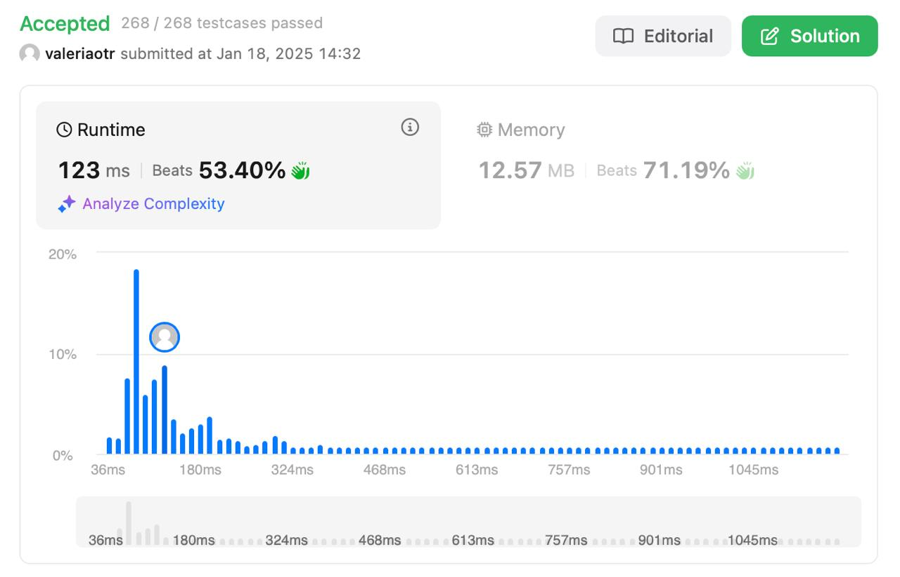

# Minimum Window Substring
## Level: Hard

## Description

Given two strings `s` and `t` of lengths `m` and `n` respectively, return the minimum window substring of `s` such that every character in `t` (including duplicates) is included in the window. If there is no such substring, return the empty string `""`.

The test cases will be generated such that the answer is unique.

### Example 1:

Input:
```
s = "ADOBECODEBANC", t = "ABC"
```
Output:
```
"BANC"
```
Explanation: The minimum window substring "BANC" includes 'A', 'B', and 'C' from string `t`.

### Example 2:

Input:
```
s = "a", t = "a"
```
Output:
```
"a"
```
Explanation: The entire string `s` is the minimum window.

### Example 3:

Input:
```
s = "a", t = "aa"
```
Output:
```
""
```
Explanation: Both 'a's from `t` must be included in the window. Since the largest window of `s` only has one 'a', return an empty string.

### Constraints:

- `m == s.length`
- `n == t.length`
- `1 <= m, n <= 10^5`
- `s` and `t` consist of uppercase and lowercase English letters.

## Solution

Решение использует **скользящее окно** для нахождения минимального подстрочного окна, которое содержит все символы строки `t`.

### Основные шаги:

1. **Подсчёт символов:**
   - Создаётся словарь `t_count` для хранения количества каждого символа в строке `t`.
   - Используется словарь `current_count` для отслеживания символов в текущем окне строки `s`.

2. **Расширение окна:**
   - Указатель `r` движется вправо, добавляя символы в окно.
   - Если все символы из `t` присутствуют в окне, обновляется результат.

3. **Сжатие окна:**
   - Указатель `l` движется вправо, уменьшая размер окна, пока все символы `t` остаются в окне.
   - Если символ из `t` больше не присутствует в достаточном количестве, окно перестаёт быть валидным.

4. **Возврат результата:**
   - Если найдено валидное окно, возвращается минимальное окно, иначе пустая строка.

### Примечания:
- Алгоритм имеет временную сложность \(O(m + n)\), так как каждый символ строки `s` и `t` обрабатывается не более двух раз.
- Используется \(O(|t| + |s|)\) дополнительной памяти для хранения словарей.

## Result

