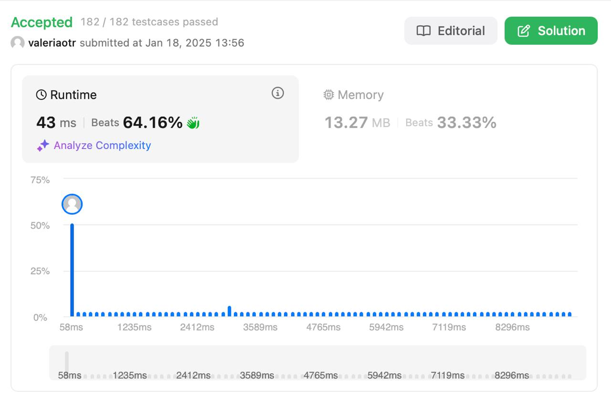

# Find Substring with Concatenation of All Words
## Level: Hard

## Description

You are given a string `s` and an array of strings `words`. All the strings in `words` are of the same length. A concatenated string is a string that exactly contains all the strings of any permutation of `words` concatenated.

Return an array of the starting indices of all the concatenated substrings in `s`. You can return the answer in any order.

### Example 1:

Input:
```
s = "barfoothefoobarman", words = ["foo","bar"]
```
Output:
```
[0,9]
```
Explanation:
The substring starting at `0` is "barfoo", which is the concatenation of ["bar","foo"].
The substring starting at `9` is "foobar", which is the concatenation of ["foo","bar"].

### Example 2:

Input:
```
s = "wordgoodgoodgoodbestword", words = ["word","good","best","word"]
```
Output:
```
[]
```
Explanation:
There is no concatenated substring.

### Example 3:

Input:
```
s = "barfoofoobarthefoobarman", words = ["bar","foo","the"]
```
Output:
```
[6,9,12]
```
Explanation:
The substrings starting at `6`, `9`, and `12` are "foobarthe", "barthefoo", and "thefoobar", respectively.

### Constraints:

- `1 <= s.length <= 10^4`
- `1 <= words.length <= 5000`
- `1 <= words[i].length <= 30`
- `s` and `words[i]` consist of lowercase English letters.

## Solution

Решение использует технику **скользящего окна** и частотные словари для проверки совпадений. Временная сложность алгоритма — \(O(N \times W)\), где \(N\) — длина строки `s`, а \(W\) — длина одного слова из `words`.

### Основные шаги:

1. **Инициализация:**
   - Вычисляются длины слов и подстроки.
   - Создается частотный словарь для массива `words`.

2. **Перебор стартовых позиций:**
   - Перебираются все возможные стартовые позиции, учитывая длину слова.

3. **Скользящее окно:**
   - Используется окно фиксированного размера для проверки, содержит ли оно все слова из `words`.

4. **Проверка совпадений:**
   - Если все слова найдены, текущая стартовая позиция добавляется в результат.

### Примечания:
- Решение эффективно для длинных строк и большого количества слов, так как минимизирует количество проверок.
- Используется библиотека `collections.Counter` для работы с частотными словарями.

## Result

