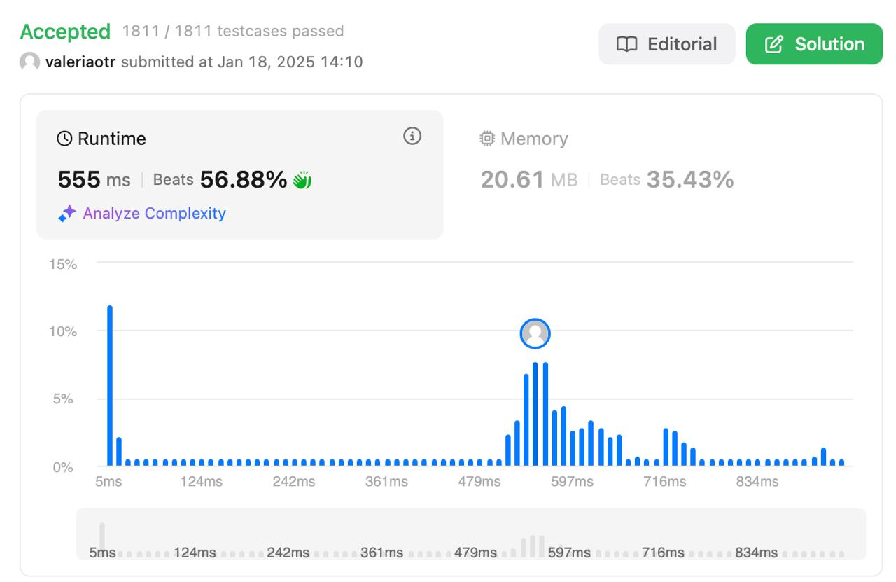

# Wildcard Pattern Matching
## Level: Hard

## Description

Implement wildcard pattern matching for a given input string `s` and a pattern `p` with support for the following special characters:

- `?` Matches any single character.
- `*` Matches any sequence of characters (including the empty sequence).

The matching should cover the entire input string (not partial).

### Example 1:

Input:
```
s = "aa", p = "a"
```
Output:
```
false
```
Explanation: "a" does not match the entire string "aa".

### Example 2:

Input:
```
s = "aa", p = "*"
```
Output:
```
true
```
Explanation: '*' matches any sequence.

### Example 3:

Input:
```
s = "cb", p = "?a"
```
Output:
```
false
```
Explanation: '?' matches 'c', but the second letter is 'a', which does not match 'b'.

### Constraints:

- `0 <= s.length, p.length <= 2000`
- `s` contains only lowercase English letters.
- `p` contains only lowercase English letters, `?`, or `*`.

## Solution

Решение использует **динамическое программирование** для проверки соответствия строки шаблону:

### Основные шаги:

1. **Инициализация таблицы DP:**
   - `dp[i][j]` указывает, соответствует ли первые `i` символов строки `s` первым `j` символам шаблона `p`.
   - Устанавливаем `dp[0][0] = True` (пустая строка соответствует пустому шаблону).
   - Заполняем случаи, когда шаблон начинается со `*` (он может представлять пустую последовательность).

2. **Заполнение таблицы DP:**
   - Если текущий символ шаблона совпадает с символом строки или равен `?`, то:
     ```
     dp[i][j] = dp[i-1][j-1]
     ```
   - Если текущий символ шаблона равен `*`, то:
     ```
     dp[i][j] = dp[i][j-1] or dp[i-1][j]
     ```
     - `*` может представлять пустую последовательность или одну/несколько последовательностей символов.

3. **Возврат результата:**
   - Значение в `dp[len(s)][len(p)]` указывает, соответствует ли вся строка шаблону.

### Примечания:
- Алгоритм имеет временную сложность \(O(n * m)\), где \(n\) и \(m\) — длины строки и шаблона соответственно.
- Используется \(O(n * m)\) памяти для хранения таблицы DP.

## Result

